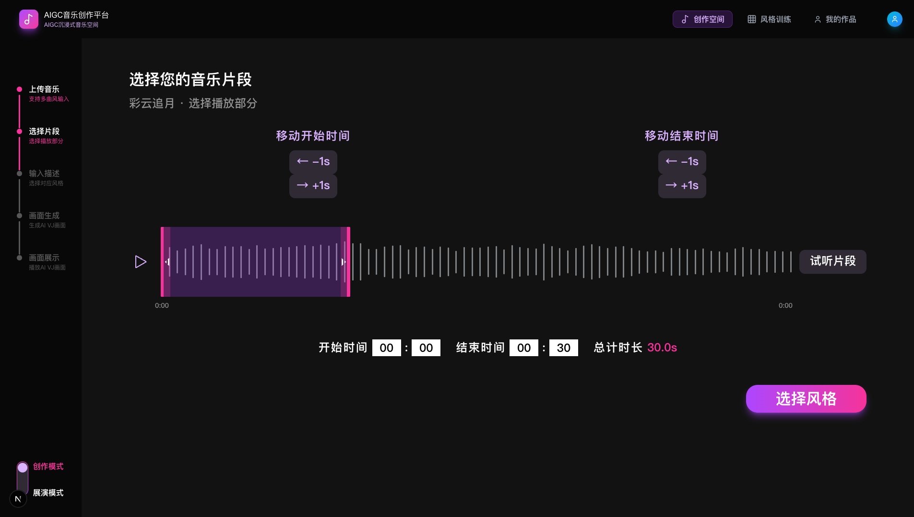
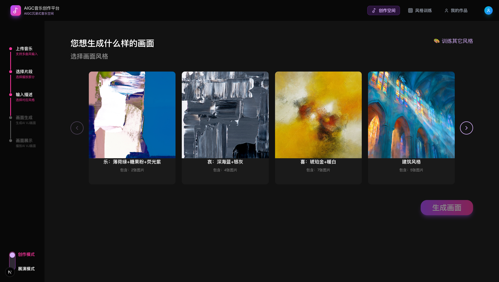
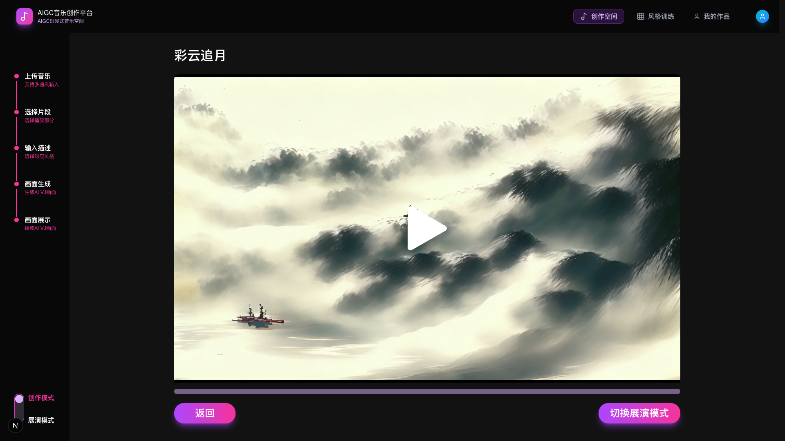
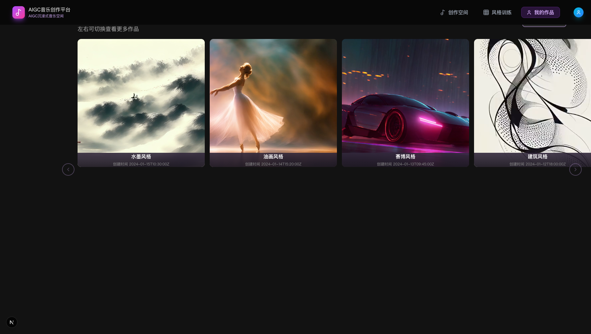
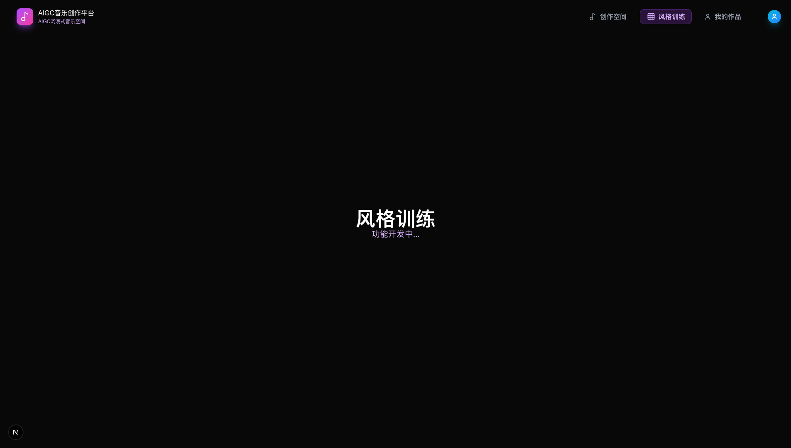

# AIGC 音乐创作平台 - 产品说明文档

> 将您的音乐转变为 VJ 画面

## 目录

- [项目概述](#项目概述)
- [技术栈](#技术栈)
- [快速开始](#快速开始)
- [功能模块](#功能模块)
  - [1. 首页 - 开始创作](#1-首页---开始创作)
  - [2. 上传音乐](#2-上传音乐)
  - [3. 选择音乐片段](#3-选择音乐片段)
  - [4. 选择风格](#4-选择风格)
  - [5. 视频生成](#5-视频生成)
  - [6. 视频播放 / 画面展示](#6-视频播放--画面展示)
  - [7. 我的作品](#7-我的作品)
  - [8. 风格训练](#8-风格训练)
- [视频生成流程](#视频生成流程)
- [任务管理机制](#任务管理机制)
- [API 路由说明](#api-路由说明)
- [配置参数](#配置参数)
- [项目结构](#项目结构)

---

## 项目概述

AIGC 音乐创作平台是一个基于 AI 的沉浸式音乐可视化创作工具。用户可以上传音乐、选择片段、选择视觉风格，由后端 ComfyUI 服务自动生成与音乐匹配的 VJ 视频画面。

## 技术栈

| 类别 | 技术 |
|------|------|
| 框架 | Next.js 16 (App Router) |
| 语言 | TypeScript |
| UI | React 19 + Tailwind CSS 4 |
| 后端服务 | ComfyUI (Python, 外部服务) |
| 数据持久化 | localStorage（客户端） |
| 包管理 | npm |

## 快速开始

```bash
# 安装依赖
npm install

# 启动开发服务器（默认端口 3001）
npm run dev

# 构建生产版本
npm run build
npm start
```

---

## 功能模块

### 1. 首页 - 开始创作

**路由：** `/`


首页展示平台的品牌介绍，以 DJ 打碟机为背景，中央显示"AIGC 音乐创作平台"标题和"将您的音乐转变为 VJ 画面"副标题。点击"开始创作"按钮进入创作空间。

**顶部导航栏**包含三个主要入口：
- **创作空间** — 进入音乐上传和视频生成流程
- **风格训练** — 自定义视觉风格（开发中）
- **我的作品** — 查看已生成的视频作品

---

### 2. 上传音乐

**路由：** `/studio`

进入创作空间后的第一步。用户可以：
- **上传本地音乐**：支持 `.flac` 和 `.mp3` 格式，上传后保存到 `public/music` 目录
- **选择示例音乐**：提供 4 首 DEMO 音乐供快速体验
  - 彩云追月（钢琴轻音乐）
  - Remember（Ólafur Arnalds）
  - 赛博空间（cyberpunk）
  - 动态空间（dynamic）

单击选中音乐卡片，双击进入片段选择页面。鼠标悬停时显示"双击进入片段选择"提示。

**左侧侧边栏**显示创作流程进度：
1. 上传音乐 ← 当前步骤（高亮）
2. 选择片段
3. 输入描述
4. 画面生成
5. 画面展示

---

### 3. 选择音乐片段

**路由：** `/select?song=xxx&title=xxx&duration=xxx`



此页面用于选择要用于视频生成的音乐片段：

- **音频波形可视化**：根据音频的实际声音强度绘制波形图，正负双向显示分贝
- **选区操作**：
  - 粉色高亮区域表示选中的音乐片段
  - 可通过拖拽红色边界线调整选区范围
  - 支持"移动开始时间"和"移动结束时间"按钮（±1s 微调）
- **时间限制**：选中片段总时长不超过 30 秒，超过时调整操作不生效并给出提示
- **试听功能**：点击播放按钮可试听选中的片段
- **状态保持**：返回此页面时，之前的时间选择不会被重置

操作完成后点击"选择风格"进入下一步。

---

### 4. 选择风格

**路由：** `/style?song=xxx&title=xxx&startTime=xxx&endTime=xxx&duration=xxx`



此页面展示可用的视觉风格卡片，每个风格对应 `public/template` 目录下的一个文件夹：

- **动态加载**：风格卡片从文件系统动态读取，风格名称即文件夹名
- **图片数量显示**：每张卡片底部显示"包含：X 张图片"
- **左右翻页**：通过左右箭头按钮切换查看更多风格
- **DEMO 默认选中**：
  - demo1 → 水墨风格
  - demo2 → 油画风格
  - demo3 → 赛博风格
  - demo4 → 喜：琥珀金+暖白
- **训练入口**：右上角"训练其它风格"链接跳转到风格训练页面

点击"生成画面"触发视频生成流程。**图片数量要求**：选中的风格必须包含 4-10 张图片，否则弹窗提示。

---

### 5. 视频生成

点击"生成画面"后，系统执行以下步骤（详见[视频生成流程](#视频生成流程)）：

1. 上传音频到 ComfyUI
2. 上传风格图片到 ComfyUI
3. 发起视频生成请求
4. 轮询任务状态直到完成

生成过程中会显示进度弹窗，**弹窗可关闭**，关闭后任务在后台继续运行，可在"我的作品"页面查看进度。

---

### 6. 视频播放 / 画面展示

**路由：** `/generate?video=xxx&title=xxx`



视频播放页面功能：
- **视频播放器**：播放生成的 VJ 视频画面
- **进度条**：可拖动的播放进度条
- **返回按钮**：返回上一页
- **切换展演模式**：进入全屏展演模式

---

### 7. 我的作品

**路由：** `/works`



展示用户所有生成的视频作品，采用 2×4 网格布局：

- **作品卡片**：正方形卡片，展示视频预览（成功任务使用 `<video>` 标签显示第一帧）、风格名称和创建时间
- **任务状态**：
  - ✅ **成功** — 显示视频预览，双击进入播放页面
  - ⏳ **进行中** — 显示旋转加载动画
  - 🕐 **排队中** — 显示灰色"排队中..."状态
  - ❌ **失败** — 显示警告图标和"生成失败"
- **队列提示**：如果有待处理任务，副标题显示"队列中有 X 个任务等待处理"
- **左右翻页**：箭头按钮切换查看更多作品
- **自动刷新**：每 5 秒轮询更新任务状态

---

### 8. 风格训练

**路由：** `/training`



风格训练功能目前处于开发中，页面显示"功能开发中..."提示。

---

## 视频生成流程

```
用户点击"生成画面"
        │
        ▼
  ┌─ 检查是否有正在运行的任务 ─┐
  │                            │
  │ 有 → 创建 pending 任务     │ 无 → 继续
  │      加入队列              │
  │      跳转到"我的作品"      │
  └────────────────────────────┘
        │
        ▼
  验证图片数量 (4-10张)
        │
        ▼
  计算视频参数：
  - numFrames = (endTime - startTime) × fps(16)
  - 根据第一张风格图的宽高比，最长边缩放至 1024px
        │
        ▼
  上传音频到 ComfyUI (/api/upload-audio)
        │ 进度 → 15%
        ▼
  上传风格图片到 ComfyUI (/api/upload-image)
        │ 进度 → 30%
        ▼
  发起视频生成请求 (/api/generate-video)
        │ 进度 → 35%
        ▼
  每 5 秒轮询任务状态 (/api/tasks/{taskId})
        │ 进度 → 35%~100%
        ▼
  ┌─────────────────┐
  │ 完成 → 更新状态  │
  │ 失败 → 标记失败  │
  │ 超时(1h) → 失败  │
  └─────────────────┘
        │
        ▼
  检查队列，启动下一个 pending 任务
```

## 任务管理机制

| 机制 | 说明 |
|------|------|
| **单任务运行** | 同一时间只有一个任务可以处于 `processing` 状态 |
| **任务排队** | 当已有任务运行时，新任务进入 `pending` 队列 |
| **自动接续** | 任务完成或失败后，自动从队列中取出下一个 pending 任务启动 |
| **超时处理** | processing 状态超过 1 小时自动标记为 `failed` |
| **断线恢复** | 页面重新加载时，验证所有 processing 任务在 ComfyUI 中的实际状态 |
| **错误处理** | ComfyUI 返回 404/500 等错误时，任务自动标记为失败并显示具体错误信息 |
| **数据持久化** | 任务数据保存在 `localStorage`，刷新页面不丢失 |

## API 路由说明

### 前端 API 路由（Next.js）

| 路由 | 方法 | 说明 |
|------|------|------|
| `/api/upload` | POST | 上传音乐文件到 `public/music` |
| `/api/music/[...path]` | GET | 读取本地音乐文件 |
| `/api/templates` | GET | 获取所有风格模板列表 |
| `/api/templates/[styleName]` | GET | 获取指定风格的图片列表 |
| `/api/comfyui/upload` | POST | 代理上传文件到 ComfyUI（音频/图片） |
| `/api/comfyui/generate` | POST | 代理视频生成请求到 ComfyUI |
| `/api/comfyui/status/[taskId]` | GET | 代理查询 ComfyUI 任务状态 |
| `/api/comfyui/output/[...path]` | GET | 代理访问 ComfyUI 输出文件 |

### ComfyUI 后端 API（外部服务）

| 端点 | 方法 | 说明 |
|------|------|------|
| `/api/upload-audio` | POST | 上传音频文件 |
| `/api/upload-image` | POST | 上传风格图片 |
| `/api/generate-video` | POST | 发起视频生成任务 |
| `/api/tasks/{taskId}` | GET | 查询任务状态 |

## 配置参数

所有可调参数集中在 `config/generate.ts` 中：

```typescript
generateConfig = {
  video: {
    maxSize: 1024,          // 视频最长边（px）
    defaultWidth: 1024,     // 默认宽度
    defaultHeight: 1024,    // 默认高度
    fps: 16,                // 帧率
  },
  styleImages: {
    minCount: 4,            // 最少图片数量
    maxCount: 10,           // 最多图片数量
  },
  task: {
    timeoutSeconds: 3600,   // 任务超时（1小时）
    pollIntervalMs: 5000,   // 轮询间隔（5秒）
    errorDisplayMs: 5000,   // 错误提示时长
  },
  progress: {
    afterAudioUpload: 15,   // 音频上传后进度(%)
    afterImageUpload: 30,   // 图片上传后进度(%)
    afterGenerateStart: 35, // 开始生成后进度(%)
    estimatedTimeSeconds: 360, // 预估生成时间(秒)
  },
};
```

## 项目结构

```
vj-disp-fe/
├── app/                          # Next.js App Router 页面
│   ├── page.tsx                  # 首页（Hero）
│   ├── layout.tsx                # 全局布局
│   ├── globals.css               # 全局样式
│   ├── studio/page.tsx           # 上传音乐页面
│   ├── select/page.tsx           # 片段选择页面
│   ├── style/page.tsx            # 风格选择页面
│   ├── generate/page.tsx         # 视频播放页面
│   ├── works/page.tsx            # 我的作品页面
│   ├── training/page.tsx         # 风格训练页面
│   └── api/                      # API 路由
│       ├── upload/route.ts
│       ├── music/[...path]/route.ts
│       ├── templates/route.ts
│       ├── templates/[styleName]/route.ts
│       └── comfyui/
│           ├── upload/route.ts
│           ├── generate/route.ts
│           ├── status/[taskId]/route.ts
│           └── output/[...path]/route.ts
├── components/                   # 共享组件
│   ├── Header.tsx                # 顶部导航栏
│   ├── Sidebar.tsx               # 左侧进度侧边栏
│   ├── Hero.tsx                  # 首页 Hero 区域
│   ├── MusicPlayer.tsx           # 音乐播放器
│   └── UploadSection.tsx         # 上传音乐区域
├── config/
│   └── generate.ts               # 视频生成配置参数
├── data/
│   ├── tasks.ts                  # 任务管理模块
│   └── works.ts                  # 静态示例作品数据
├── public/
│   ├── images/                   # 静态图片资源
│   ├── music/                    # 音乐文件（含 DEMO）
│   ├── videos/                   # 示例视频
│   ├── template/                 # 风格模板图片（按文件夹分类）
│   ├── works/                    # 作品缩略图
│   └── icons/                    # 图标资源
├── docs/                         # 文档及截图
├── package.json
├── tsconfig.json
├── next.config.ts
└── tailwind / postcss / eslint   # 配置文件
```
